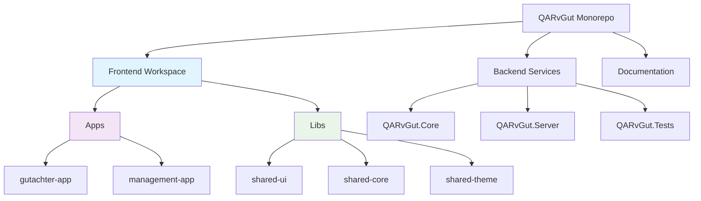

# Epic: Monorepo Architecture Implementation

**Epic ID:** EPIC-MONOREPO-001  
**Epic Title:** Transform QARvGut to Nx-Powered Monorepo Architecture  
**Epic Owner:** Product Owner (Sarah)  
**Created:** August 13, 2025  
**Status:** Planning  
**Priority:** High  

## Epic Summary

Transform the QARvGut project from a single Angular client structure to a comprehensive Nx-powered monorepo architecture supporting multiple Angular applications (Gutachter and Management) with shared libraries and unified .NET backend services.

## Business Value

### Primary Business Drivers
- **Scalability:** Enable independent development of assessor and management applications
- **Code Reusability:** Reduce development time through shared components and services
- **Team Productivity:** Allow parallel development by different teams
- **Maintainability:** Centralized shared logic and consistent architecture
- **User Experience:** Tailored interfaces for different user roles while maintaining consistency

### Success Metrics
- **Development Velocity:** 30% reduction in duplicate code across applications
- **Build Performance:** Optimized build times through Nx smart caching
- **Developer Experience:** Single repository setup reduces onboarding time by 50%
- **Code Quality:** Consistent linting and testing across all applications

## Epic Scope

### In Scope
- Nx workspace setup with Angular 19
- Migration of existing client to gutachter-app
- Creation of new management-app structure
- Shared UI component library
- Shared core services library
- Shared theming and styling library
- Unified build and deployment pipeline
- Documentation and development guidelines

### Out of Scope (Future Epics)
- Actual feature development for management-app
- Advanced Nx plugins (Storybook, Cypress, etc.)
- Micro-frontend architecture
- Backend monorepo integration

## User Personas Affected

### Primary Users
- **Frontend Developers:** Need efficient development environment with code reuse
- **DevOps Engineers:** Require streamlined build and deployment processes
- **Project Managers:** Need clear separation of applications for team management

### Secondary Users
- **QA Engineers:** Benefit from consistent testing frameworks
- **UX Designers:** Work with shared component library for design consistency

## Technical Architecture Overview

## Dependencies & Risks

### Dependencies
- Angular 19 compatibility with Nx
- Existing client code migration
- Team training on Nx tooling
- CI/CD pipeline updates

### Risks & Mitigations
- **Risk:** Complex migration breaks existing functionality
  - **Mitigation:** Incremental migration with feature flags
- **Risk:** Team adoption curve for Nx tooling
  - **Mitigation:** Training sessions and documentation
- **Risk:** Build performance initially slower during setup
  - **Mitigation:** Nx caching and optimization configuration

## Acceptance Criteria

### Epic-Level Acceptance Criteria
1. **Architecture Setup Complete**
   - Nx workspace successfully created and configured
   - All applications build without errors
   - Shared libraries properly integrated

2. **Existing Functionality Preserved**
   - Current gutachter functionality works identically
   - All existing tests pass
   - No regression in user experience

3. **Development Workflow Established**
   - Developers can run both applications locally
   - Shared libraries can be developed and consumed
   - Build and test scripts work across all projects

4. **Documentation Complete**
   - Developer setup guide created
   - Architecture documentation updated
   - Contribution guidelines established

## Story Breakdown

The epic is broken down into the following user stories:

1. **STORY-MONO-001:** As a developer, I want an Nx workspace structure so I can work with multiple Angular applications
2. **STORY-MONO-002:** As a developer, I want to migrate existing client code so current functionality is preserved
3. **STORY-MONO-003:** As a developer, I want shared UI components library so I can reuse components across applications
4. **STORY-MONO-004:** As a developer, I want shared core services library so I can share business logic
5. **STORY-MONO-005:** As a developer, I want shared theming library so applications have consistent styling
6. **STORY-MONO-006:** As a developer, I want management app structure so I can start building management features
7. **STORY-MONO-007:** As a developer, I want build and development scripts so I can efficiently work with the monorepo

## Timeline Estimate

- **Planning & Setup:** 2 days
- **Migration & Implementation:** 5 days  
- **Testing & Validation:** 2 days
- **Documentation:** 1 day
- **Total:** 10 days (2 weeks)

## Definition of Done

- [ ] All user stories completed and accepted
- [ ] Nx workspace fully functional
- [ ] Existing functionality preserved and tested
- [ ] Shared libraries created and documented
- [ ] Build scripts and development workflows established
- [ ] Team training completed
- [ ] Documentation updated and reviewed
