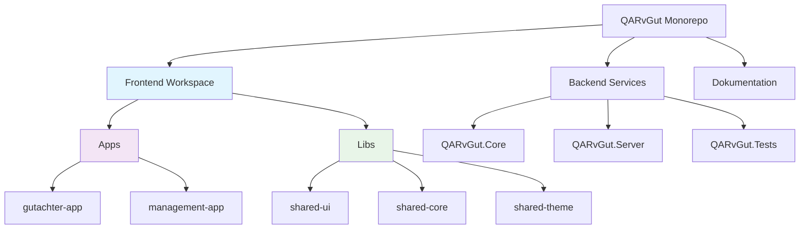

# Epic: Monorepo-Architektur Imp### Im Umfang (MVP)

- Nx workspace setup mit Angular 19
- Migration des bestehenden Clients zu gutachter-app
- Grundlegende management-app Struktur (nur Scaffolding)
- Minimale geteilte Core-Services (nur Auth)
- Basis Build- und Serve-Skripte

### Out of Scope (Zukünftige Sprints)

- Vollständige geteilte UI-Komponenten-Bibliothek
- Umfassende Core-Services-Bibliothek
- Shared-Theme-Bibliothek
- Erweiterte Nx-Features (Caching, Optimierung)
- Management-app Feature-Implementierung
- Umfassende Dokumentation*Epic ID:** EPIC-MONOREPO-001  
**Epic Titel:** QARvGut zu Nx-betriebener Monorepo-Architektur transformieren  
**Epic Besitzer:** Product Owner (Sarah)  
**Erstellt:** 13. August 2025  
**Status:** Planung  
**Priorität:** Hoch  

## Epic Zusammenfassung

Transformation des QARvGut-Projekts von einer einzelnen Angular-Client-Struktur zu einer umfassenden Nx-betriebenen Monorepo-Architektur, die mehrere Angular-Anwendungen (Gutachter und Management) mit geteilten Bibliotheken und einheitlichen .NET-Backend-Services unterstützt.

## Geschäftswert

### Primäre Geschäftstreiber

- **Skalierbarkeit:** Unabhängige Entwicklung von Gutachter- und Management-Anwendungen ermöglichen
- **Code-Wiederverwendbarkeit:** Entwicklungszeit durch geteilte Komponenten und Services reduzieren
- **Team-Produktivität:** Parallele Entwicklung durch verschiedene Teams ermöglichen
- **Wartbarkeit:** Zentralisierte geteilte Logik und konsistente Architektur
- **Benutzererfahrung:** Maßgeschneiderte Benutzeroberflächen für verschiedene Benutzerrollen bei gleichzeitiger Konsistenz

### Erfolgskennzahlen

- **Entwicklungsgeschwindigkeit:** 30% Reduzierung von doppeltem Code zwischen Anwendungen
- **Build-Performance:** Optimierte Build-Zeiten durch Nx Smart Caching
- **Entwicklererfahrung:** Einzelnes Repository-Setup reduziert Onboarding-Zeit um 50%
- **Code-Qualität:** Konsistentes Linting und Testing über alle Anwendungen

## Epic Umfang

### Im Umfang

- Nx Workspace Setup mit Angular 19
- Migration des bestehenden Clients zu gutachter-app
- Erstellung der neuen management-app Struktur
- Geteilte UI-Komponenten-Bibliothek
- Geteilte Core-Services-Bibliothek
- Geteilte Theming- und Styling-Bibliothek
- Einheitliche Build- und Deployment-Pipeline
- Dokumentation und Entwicklungsrichtlinien

### Außerhalb des Umfangs (Zukünftige Epics)

- Tatsächliche Feature-Entwicklung für management-app
- Erweiterte Nx-Plugins (Storybook, Cypress, etc.)
- Micro-Frontend-Architektur
- Backend-Monorepo-Integration

## Betroffene Benutzer-Personas

### Primäre Benutzer

- **Frontend-Entwickler:** Benötigen effiziente Entwicklungsumgebung mit Code-Wiederverwendung
- **DevOps-Ingenieure:** Benötigen optimierte Build- und Deployment-Prozesse
- **Projektmanager:** Benötigen klare Trennung der Anwendungen für Team-Management

### Sekundäre Benutzer

- **QA-Ingenieure:** Profitieren von konsistenten Testing-Frameworks
- **UX-Designer:** Arbeiten mit geteilter Komponenten-Bibliothek für Design-Konsistenz

## Technische Architektur-Übersicht

## Abhängigkeiten & Risiken

### Abhängigkeiten

- Angular 19 Kompatibilität mit Nx
- Migration des bestehenden Client-Codes
- Team-Schulung für Nx-Tooling
- CI/CD-Pipeline-Updates

### Risiken & Gegenmaßnahmen

- **Risiko:** Komplexe Migration bricht bestehende Funktionalität
  - **Gegenmaßnahme:** Schrittweise Migration mit Feature Flags
- **Risiko:** Team-Lernkurve für Nx-Tooling
  - **Gegenmaßnahme:** Schulungssitzungen und Dokumentation
- **Risiko:** Build-Performance anfangs langsamer während Setup
  - **Gegenmaßnahme:** Nx Caching und Optimierungs-Konfiguration

## Abnahmekriterien

### Epic-Level Abnahmekriterien

1. **Architektur-Setup Abgeschlossen**
   - Nx Workspace erfolgreich erstellt und konfiguriert
   - Alle Anwendungen bauen ohne Fehler
   - Geteilte Bibliotheken ordnungsgemäß integriert

2. **Bestehende Funktionalität Bewahrt**
   - Aktuelle Gutachter-Funktionalität funktioniert identisch
   - Alle bestehenden Tests bestehen
   - Keine Regression in der Benutzererfahrung

3. **Entwicklungs-Workflow Etabliert**
   - Entwickler können beide Anwendungen lokal ausführen
   - Geteilte Bibliotheken können entwickelt und genutzt werden
   - Build- und Test-Skripte funktionieren über alle Projekte

4. **Dokumentation Vollständig**
   - Entwickler-Setup-Leitfaden erstellt
   - Architektur-Dokumentation aktualisiert
   - Beitrags-Richtlinien etabliert

## Story Aufschlüsselung (MVP - 3 Tage)

Das Epic ist in folgende User Stories aufgeteilt:

1. **STORY-MONO-001:** Als Entwickler möchte ich eine grundlegende Nx Workspace-Struktur (2 Punkte, 1 Tag)
2. **STORY-MONO-002:** Als Entwickler möchte ich bestehenden Client-Code migriert (3 Punkte, 1.5 Tage)  
3. **STORY-MONO-006-LIGHT:** Als Entwickler möchte ich eine minimale Management-App-Struktur (1 Punkt, 0.5 Tage)

**Gesamt:** 6 Story Points (3 Tage)

## Zeitplan-Schätzung (Reduziert)

- **MVP-Setup & Migration:** 2 Tage
- **Grundlegende Shared Libraries:** 0.5 Tage
- **Testing & Validierung:** 0.5 Tage
- **Gesamt:** 3 Tage (MVP-Ansatz)

## Definition of Done

- [ ] Alle User Stories abgeschlossen und akzeptiert
- [ ] Nx Workspace vollständig funktionsfähig
- [ ] Bestehende Funktionalität bewahrt und getestet
- [ ] Geteilte Bibliotheken erstellt und dokumentiert
- [ ] Build-Skripte und Entwicklungs-Workflows etabliert
- [ ] Team-Schulung abgeschlossen
- [ ] Dokumentation aktualisiert und überprüft
